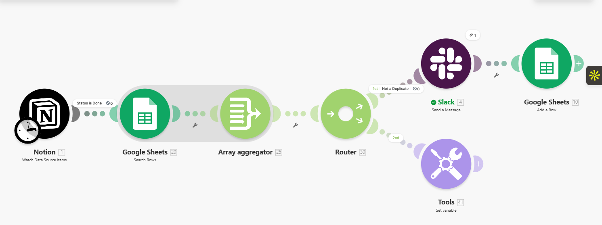
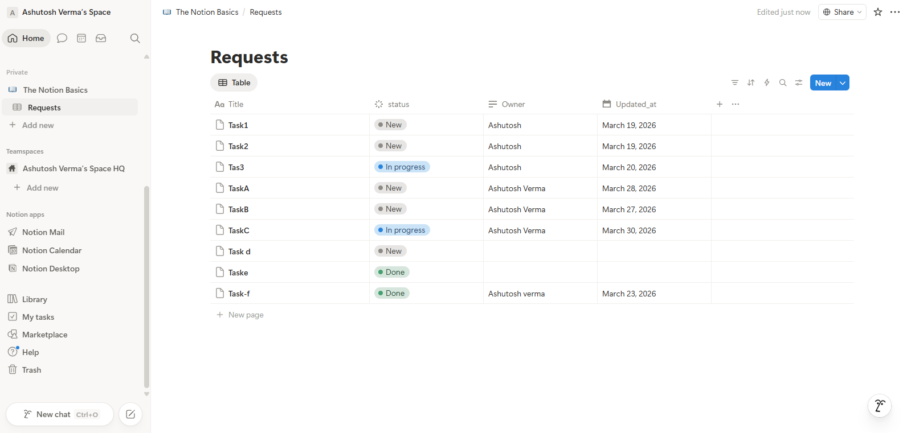
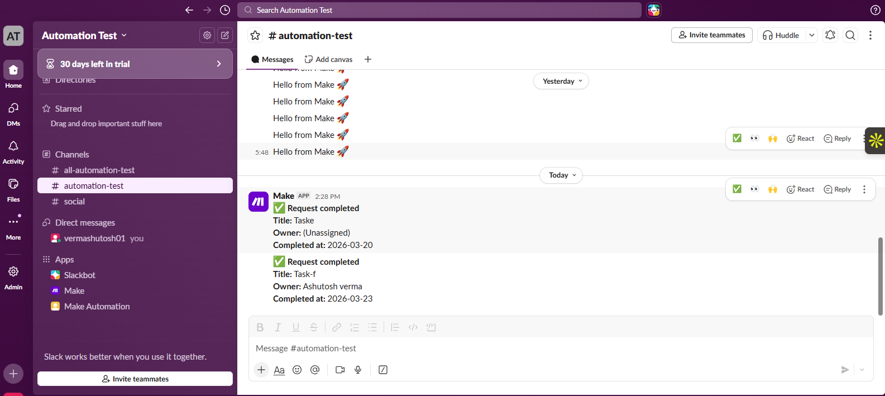
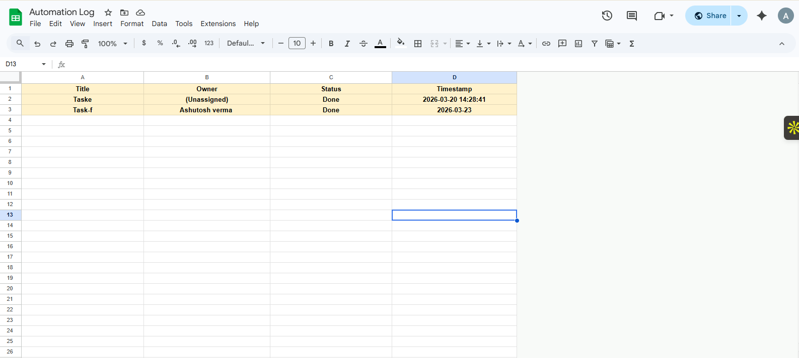
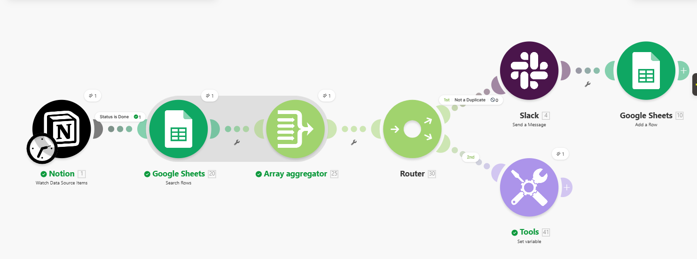
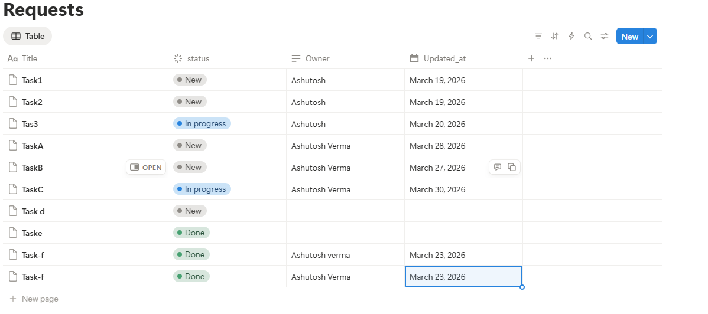

# Testing Proof & Results

This document provides visual evidence that the automation scenario was thoroughly tested and works exactly as required.

---

### 🖥️ Make.com Scenario Overview

This is how the workflow is laid out in the Make.com editor.

_Description: The complete automation flow showing Notion, Google Sheets Search, Router, and Action modules._

---

### 📋 Notion Source Dashboard

The source dashboard in Notion where task statuses are updated.

_Description: Showing the "Requests" database with tasks in various statuses._

---

### ✅ 1. Successful Run (Notion to Slack & Google Sheets)

When a status in Notion changes to **"Done"**, the automation triggers.

#### 💬 Slack Notification

_Description: Clean notification sent to Slack with task details and formatting. It correctly handles empty fields—if an owner is missing it shows (Unassigned), and if a title is missing it shows (No title)._

#### 📊 Google Sheets Log

_Description: New row added correctly to the "Automation Log" spreadsheet._

---

### 🛡️ 2. Duplicate Protection (Checking for double-entries)

If the same "Done" task is updated again, the automation **stops** to avoid duplicates.

#### 🔄 Make.com Execution Path

_Description: Detailed flow breakdown:_

- _The small number bubbles show the data successfully passing from Notion to the Duplicate Search module._
- _The **green checkmark** on the lower path (Route 2) confirms that the automation correctly identified the duplicate._
- _The upper path (Slack) shows a **gray circle**, indicating the filter correctly BLOCKED the duplicate from being sent to Slack or logged again._

#### 🔍 Specific Duplicate Search Evidence

_Description: Evidence showing the Search module successfully identified the existing task name._

---
